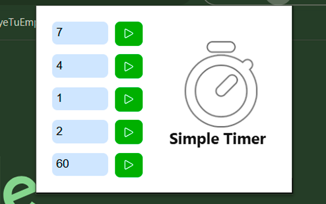
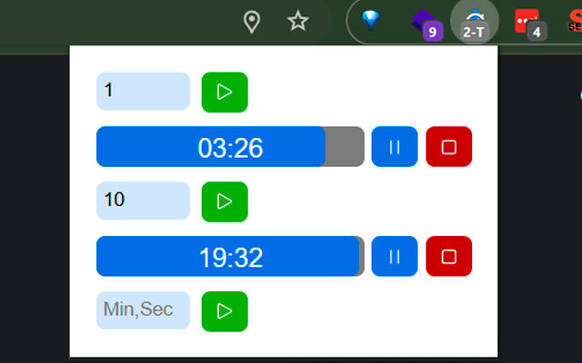

# Extensión Simple Timer

Cinco temporizadores simples que se pueden usar para medir el tiempo de tus tarea.

[Extensión Disponible aquí](https://chromewebstore.google.com/detail/simple-timer/fepcghiedlojkgidicokpnhifnfbmabe)
Disponible en Chrome, Edge, Opera y Brave

Imagen de la nueva versión de la interfaz de la extensión:

## Creada por:

[Sebastián Sanhueza Tapia](https://www.linkedin.com/in/sebastiansanhuezatapia/)
[Repositorio aquí](https://github.com/SuKuShaing/Extension-Simple-Timer)

## To Do

-   [x] Se añade una transición a la aparición y desaparición de las líneas diagonales que visualizan el tiempo corriendo
-   [x] Colocarle borde al logo de la extensión cosa de que sea más visible en temas claros
-   [x] Que todo el temporizador se coloque en azul y no solo la tapa al momento de estar activo
-   [x] Que cuando el tiempo esté encendido hayan unas lineas diagonales más claras que se muevan para mostrar el avance del tiempo
-   [x] Que al momento de pausar el color del budge sea un gris #7b7b7b
-   [x] que se pueda ingresar ,7 en vez de 0,7
-   [x] Que cada minuto que se despierte para cambiar el badge, verifique cuanto tiempo realmente tiene, ahí cambia el badge y ahí recién programa la alarma para despertar el siguiente minuto
-   [x] Colocar Iconos más bonitos en los botones
-   [x] Que muestre el tiempo en el logo cuando tenga un temporizador activo, sí hay dos activos, que muestre el tiempo de los dos, sí hay más que muestre el número de temporizadores activos 3T por ejemplo
-   [x] Que se puedan ingresar segundos en el input
-   [x] Al darle Enter en el input se debe iniciar el temporizador
-   [x] Bug al pausar no se ve el icono en modo normal, solo en activo
-   [x] Bug al pausar se ve el logo
-   [x] Solución al bug de que se coloca el icono en modo normal cuando debería estar en modo activo
-   [x] Resolver el bug de desactivación de los temporizadores cuando habían varios a la vez
-   [x] Modificar el CSS para que se vea mejor tiempo y dentro de la barra
-   [x] Colocar en la función notify que ejecute el sonido de finalizado -> 
_MV3 no permite reproducir sonidos desde el service worker (background.js), solo desde el popup.js y cuando el popup.html esté abierto_

-   [x] En la función notify que se envíe a eliminar el temporizador finalizado
-   [x] En la función notify que se envíe a actualizar el icono de la extensión a normal
-   [x] La función de actualizar el icono de la extensión debe verificar si hay al menos un temporizador activo

---

### Versiones

#### Versión 1.10 (Disponible en Chrome Web Store)

-   Se añade una transición a la aparición y desaparición de las líneas diagonales que visualizan el tiempo corriendo

#### Versión 1.9

-   Se cambia el funcionamiento del badge, ahora se marca bien el comportamiento entre pausado y activo
-   Ahora el logo del temporizador tiene una mejor apariencia en temas claros
-   Ahora el logo del temporizador muestra claramente cuando está activo o pausado
-   Se añaden lineas diagonales que se mueven para mostrar el avance del tiempo

#### Versión 1.8

-   Se corrige el bug de que el badge no se actualizaba con la tiempo correctamente
-   Ahora se acepta ingresar .7 y 0,7 a la vez
-   Se añaden colores relativos con el sistema hsl

#### Versión 1.7

-   Se añade un icono de inicio, pausa y reset más bonito y se mejora al interfaz en general
-   Se añade un badge a la extensión que muestra la cantidad de temporizadores activos y sí hay uno solo, que muestre el tiempo restante en minutos
-   Ahora se pueden ingresar segundos en el input
-   Ahora al darle Enter en el input se inicia el temporizador

#### Versión 1.6

-   Se arregla el bug del parpadeo al pausar y resetear los temporizadores
-   Se arregla el bug de que se coloca el icono en modo activo cuando debería estar en modo normal al pausar
-   Se arregla el bug de que al pausar y resetear los temporizadores, el icono de la extensión se coloca en modo activo

#### Versión 1.5

-   Se resuelve el bug de desactivación de los temporizadores, cuando habían más de 2 temporizadores activos
-   Se añade el icono de la extensión a la parte vacía del popup
-   Se mejora la visualización del tiempo en la barra de tiempo

#### Versión 1.4

-   Cambia el icono de la extensión cuando se active al menos un temporizador
-   Se sincroniza la página de popup con el estado de los temporizadores, para que siempre se muestre el estado y el tiempo correcto de los temporizadores
-   Se añade la API de chrome.alarms para que despierte al Service Worker y pueda enviar la notificación de finalización del temporizador
-   Se experimenta con la reproducción de sonidos pero no es viable porque no permite reproducir sonidos a menos que el popup esté abierto

#### Versión 1.3

-   Ahora la notificación se muestra a pesar de que el navegador esté minimizado
-   Se cambia el mensaje de la notificación para que muestre el tiempo ingresado por el usuario en vez del id del temporizador
-   Se arreglan bugs.

#### Versión 1.2

-   Se sacan permisos innecesarios.
-   Se arreglan bugs.

#### Versión 1.1

-   Ahora si funciona.
-   Se arreglan bugs.

#### Versión 1.0

-   ¡Está vivo!, ¡está vivo!
-   Funciona.

---

### Atribuciones

-   Icono y logo de la extensión "[Stopwatch](https://tabler.io/icons/icon/stopwatch)", bajo [Licencia MIT](https://opensource.org/license/mit)
